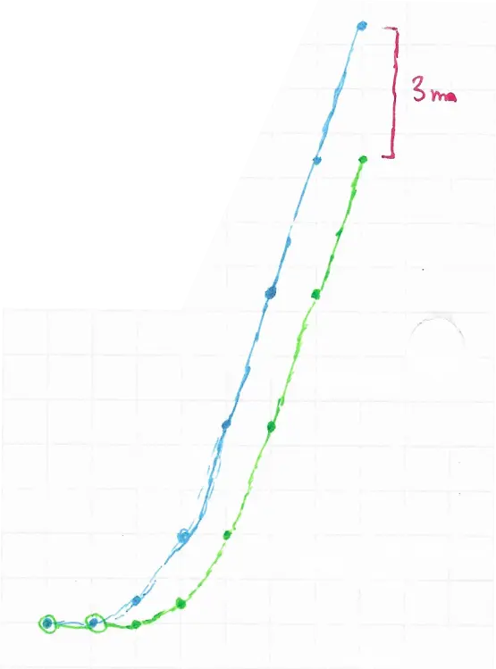

---  
tags:
  - physics
  - kinematics
  - mind_bending
category: puzzles  
date: 2022-11-25 01:00 -0600  
title: The counterintuitive physics behind vehicle following distances  
commentslug: 2022-integral-surprise  
toc: true
mathjax: true
---

Someone recently asked me, "What is something surprising or amusing you learned recently?" I solved a puzzle that is counterintuitive on its face but makes total sense after thinking it through.

So, since I started driving recently, I noticed that if back-to-back cars have equal acceleration, they naturally create a following distance based on the following driver's reaction time. Is this real? Kinematics and integrals to the rescue!

So, first, let's pretend that we have two cars with following distance $$d_f = 0$$ at a traffic light.
At t=0, the lights turn green, and the velocity of both cars is 0. Velocity-time graphs are the key here because they show both distance and acceleration as area and slope, respectively.

At t=1 the front car starts accelerating at a constant acceleraiton of $$1m/s^2$$, and at t=2, trying to match the front car, the back car does the same.

Then, let's say, at t=4, at 3m/s, the front stops accelerating, and at t=5, after reaching the same velocity, the back stops accelerating.

Throughout the period when they were both accelerating, they had a velocity differential **relative to one another** of 1m/s.
*That* is where they gain the following distance. Since **acceleration is constant, but velocity is not equal**.

The area between those two curves, $$d_f = \int v_b - v_g \, dt$$ is the following distance, the parallelogram, in this case, is equal to the total velocity times the reaction time, $$3m/s * 1s = 3m$$.

The same phenomenon applies when braking, where as two drivers push on the break equally hard, the distance between them gradually decreases as they come to a stop.

Looking at the distance-time graph, which starts quadratic and then settles into linear, explains this phenomenon even better.

<!--CGP Grey [unhelpfully points out](https://www.youtube.com/watch?v=iHzzSao6ypE) that stopping monkeys from driving cars, and having coordinated acceleration would solve all traffic problems. No. It wouldn't. Accelerating at the same time means leaving no following gap, which, unless cars are perfect and 100% reliable, can be disastrous at high speeds.

P.S. Yes I know that it might be acceptable to accelerate simultaeneously out of an intersection and then leave some space later, there are always more complex algorithms that can come up with reasonable compromises between safety and efficiency.

P.-->P.S. Humans do not drive with constant acceleration and instead have complex feedback loops. This is simply a high-level overview of this pattern in an ideal universe.

