---  
tags:
  - code
  - self_hosting
category: tech  
date: 2022-12-27 00:30 -0600  
title: I went viral! The UnifiedPush - F-Droid blog post  
commentslug: 2022-fdroid-up  
toc: false
mathjax: false
---

Go check my guest blog post on the F-Droid blog! <https://f-droid.org/en/2022/12/18/unifiedpush.html>

I have been working on [UnifiedPush](https://unifiedpush.org) for the past 2 years, and surprisingly never wrote about it here.

I was pleasantly surprised by the attention we got, with [700+ upvotes and lots of discussion on Hacker News](https://news.ycombinator.com/item?id=34094497), [800+ combined upvotes on Reddit](https://old.reddit.com/submit?url=https%3A%2F%2Ff-droid.org%2F2022%2F12%2F18%2Funifiedpush.html), [many boosts on Fedi](https://fosstodon.org/@unifiedpush/109558189004184800) and lots of people joining our chat to ask for help w/ UP.

I drafted and co-ordinated w/ F-Droid to [publish](https://gitlab.com/fdroid/fdroid-website/-/merge_requests/890) this. I had editing help from these awesome folks:

- binwiederhier (developer of [ntfy.sh](https://ntfy.sh))
- [MayeulC](https://github.com/MayeulC) - UnifiedPush contributor
- [S1m](https://github.com/p1gp1g/) - Of course, creator of UnifiedPush

And my friend Jaxzog.

In the process, I made this fancy diagram:

