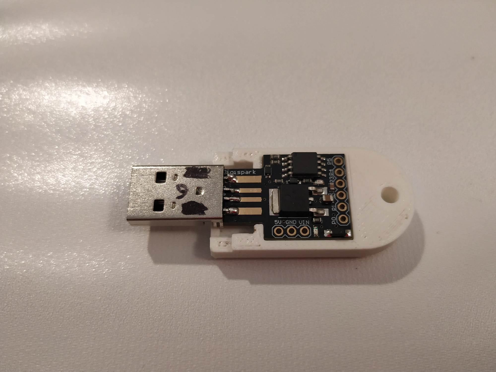

---  
tags:
  - code
  - hacking
category: tech  
date: 2022-12-27 01:30 -0600  
title: "Project Oreo: Cheap USB Rubber Ducky [Part 1]"
commentslug: 2022-oreo1  
toc: false
mathjax: false
---

OK what's a cooler way to prank people than to change their desktop background into an absurd image? It’s even cooler if this process involves unusual tech.

[Rubber Duckies are cool](https://hackaday.com/tag/rubber-ducky/)

Demo:
<iframe width="560" height="315" src="https://www.youtube-nocookie.com/embed/FbiJCnHBr70" title="YouTube video player" frameborder="0" allow="accelerometer; autoplay; clipboard-write; encrypted-media; gyroscope; picture-in-picture" allowfullscreen=""></iframe>

Find my code [on GitHub](https://github.com/karmanyaahm/rubber_ducky/tree/v1/v2win) (v1 is code as of writing this blog post).

This is a quick summary of my process, I'll update this post w/ more details later.

Take a ~$2 microcontroller in a USB form factor, the Digispark, program it with a virtual (bit-bang) USB stack to emulate a Keyboard ([already done by them](https://github.com/digistump/DigisparkArduinoIntegration/blob/master/libraries/DigisparkUSB/DigiUSB.cpp)). Add a proper USB jack and a 3d printed case (thanks to my friend Jaxzog for doing the 3d work!). And you get a very adept and flexible but cheap prank device.

It is also educational, demonstrating the hazards of leaving computers unattended and unlocked. This just changes your desktop background, but it is easy to imagine something that steals private data.

I have been working on Project Oreo since the start of the 2022-23 school year. There is still a lot more to be done to optimize this.
- OS Detection (fingerprint the order of USB packets to detect which OS is connected, currently, one device only does one OS)
- A funnier image
- Faster, more efficient keystroke sequences

Thanks to Jaxzog for the case design and help with creating keystroke sequences.
## Cool Tech
#### Polyglots

For the Windows version, I use file format polyglots to hide my powershell script payload. A polyglot is one file that is two different things at once depending on the point of view. My background image contains the background changing script in a header comment, so when read by powershell, it is a script, but when read by a PNG image parser, it is an image.
#### IPFS

The image is hosted on the content-addressed IPFS, so the Windows script can loop through multiple servers in case one is blocked, and will end up getting the same image.
