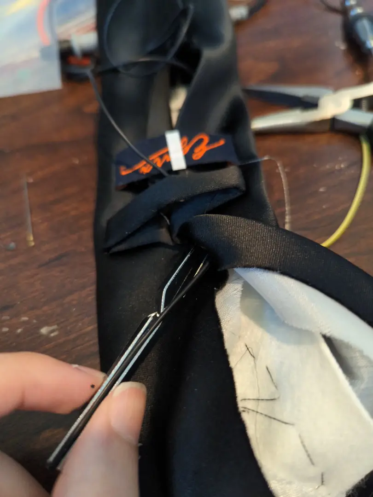

---  
tags:
  - hardware
  - wearables
  - sewing
category: projects  
date: 2023-04-29 19:00 -0600  
title: "Making an Addressable LED Ampli-Tie*"  
commentslug: 2023-amplitie1  
toc: false
mathjax: false
---

The microphone part doesn't fully work yet, but here's my Flora NeoPixel Tie.

### Idea

I had several Flora NeoPixels and conductive thread lying around since a previous project, so on Feb 19, I decided to make an Ampli-Tie for Prom (March 25), which meant that unlike most, this project had a hard deadline [HC](https://hackclub.slack.com/archives/CNMU9L92Q/p1676982774895349?thread_ts=1676956733.424689&cid=CNMU9L92Q).

Parts:
1. Flora NeoPixels (13)
2. Adafruit Conductive Thread (2-ply, ymmv) 
3. Microcontroller - I used a Seeed Xiao nRF52840 because of integrated BLE
4. A microphone (I used a generic MAX4466-based mic, wouldn't recommend)
4. This really nice silicone stranded [ribbon cable from Amazon](https://www.amazon.com/dp/B099W8HH6J)
4. Black Paint/Paint Pen
5. General soldering supplies (Tweezers, Helping Hands, Solder, Iron)
3. General sewing supplies (Black string, Fray Check/Super Glue, Needles) 
1. And a tie, of course

### Preparation

Fast forward a month to March 18.

I started my personal engineering notebook (thanks VRC). Of all my attempts at formalizing project documentation, I have a good feeling about this one. What's better than a simple paper notebook and pencil?

As I had previously discovered, Flora NeoPixels are crazy bright. When you run them at 100% brightness they are impossible to stare at. This is great because running them at 10% brightness is more than enough for a dark hall, and instead of 60mA per pixel, you now use less than 6mA per pixel (assuming all three colors are on at once).

My goal was to stay under 100mA so I could reasonably power it through whatever internal processing happened going from `USB +5V -> VCC pin` on the microcontroller board.

{:width="50%"}
After a bit of testing, 16 NeoPixels + the microcontroller only used 62mA at 10% duty cycle with all RGB LEDs on.

{:width="50%"}
Some placement tests showed me that 13 pixels over 39cm should be perfect. Minimizing pixels minimizes build time and power consumption.

{:width="50%"}
Then, I harvested the pixels from a nonfunctional project and scraped off as much superglue as I could.

### Sewing

{:width="50%"}
After tearing open the tie, it was just hours and hours of sewing for three days straight. Terminating stitches is the hardest part, and you need to do that between every single LED, 

{:width="50%"}
So there was sewing

and testing

{:width="50%"}
and sewing

and more time spent sewing and testing the connections than the entire ideation, prototype, and wearing process (if this were YouTube this would be the build montage). Check out [Adafruit's guide](https://learn.adafruit.com/conductive-thread/overview) on sewing with Flora for more details.

{:width="50%"}

Because I didn't want to rip apart the tie, I encountered a big obstacle, the name tag. Here was where the silicone wire shined. Connecting ~ LED 3 to ~LED 10 created a "highway" of current, not only bypassing a nearly impossible stitch but also reducing total resistance by letting current bypass huge chunks of the high-resistance conductive thread.

{:width="50%"}

Finally, after soldering on the microcontroller, I had the hardware done! But did it work?

### Code

I pulled together some code from the various Adafruit tutorials, reusing the same core as their Ampli-Tie. That handled all the Bluetooth communications and core effects. The `audiobusio` mechanisms from the original Adafruit code weren't working with the nRF52840 board, so I hacked together a simple ADC-based Mic Reader in under hours. After starting this up, I realized that the mic was only outputting 3.6V all the time, being the last day, I just cut off the painted mic and replaced it with an unpainted one that I could hide under the collar. Still, when at T-2 hours the audio graph didn't work, I decided to move on with just static colors and patterns.

**The final code can be found at [github.com/karmanyaahm/neopixels](https://github.com/karmanyaahm/neopixels/blob/main/amplitie/code.py).**

{:width="45%"} {:width="40%"}

Turns out, with a pretty Cyan running at 6% brightness (more than enough for an accessory in the center of one's field of view), the whole thing consumed under 25mA at 5V (125mW). That is enough to last 60 hours using my 5000mAh power bank (assuming 3V from the battery and 50% efficiency) - I could easily downsize my power bank ... or ... ADD MORE LIGHTS! (SoonTM)

Overall, the Bluefruit app's default cyan serendipitously complimented the rest of my Navy Blue outfit, and the tie was a great party trick - literally.

Here's a video of me controlling it:
<iframe width="100%" height="720" src="https://www.youtube-nocookie.com/embed/9Y6ZV2y4E2Y" title="YouTube video player" frameborder="0" allow="accelerometer; autoplay; clipboard-write; encrypted-media; gyroscope; picture-in-picture; web-share" allowfullscreen></iframe>

