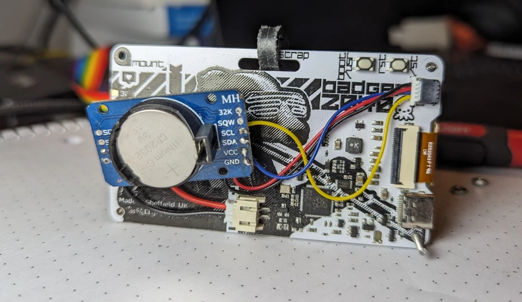
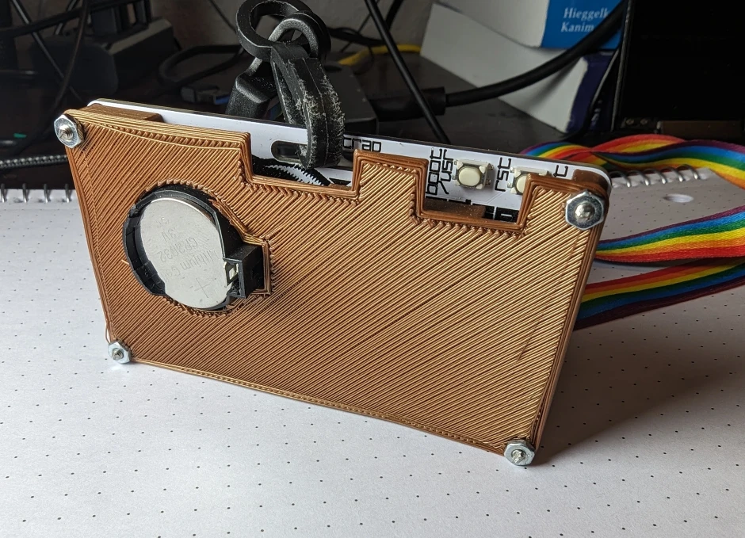
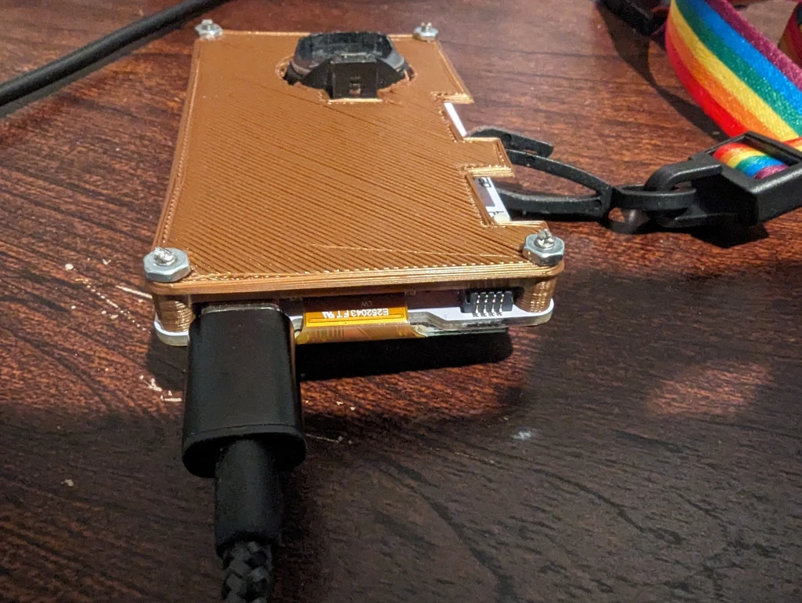

---  
tags:
  - hardware
  - python
  - security
category: projects  
date: 2023-08-11 04:25 -0500  
title: "AirGapped TOTP"  
commentslug: 2023-totp  
toc: false
mathjax: false
---

Isn't keeping your 2FA codes connected to the internet kinda insecure? In today's episode of lets overcomplicate established procedures for marginal security improvements, I made an e-ink based, battery operated TOTP device. It's a dedicated device to do TOTP, so instead of having to store them on your phone (where they can be remotely attacked), you store them in your bag (where they can be stolen 😄). However, since OTPs are the "something you have", that's alright, because random theives won't have your passwords.

<iframe width="560" height="315" src="https://www.youtube-nocookie.com/embed/7Y9NhbLoITg" title="YouTube video player" frameborder="0" allow="accelerometer; autoplay; clipboard-write; encrypted-media; gyroscope; picture-in-picture; web-share" allowfullscreen></iframe>
Is the video title catchy enough?

It uses Pimoroni's Badger2040 board, which is an awesome PCB that integrates an E-ink display and RP2040 microcontroller. 

On the back, there's a DS3231 with wires soldered to it, going to the JST-SH for I2C and a JST-PH going to the raw battery. The RP2040 gives power to the interface part of the RTC through the I2C wires. And I designed a case to protect the wiring.

More pictures, 3D files, and [code on GitHub](https://github.com/karmanyaahm/totp_device_v2).

The UX code is in the second half of `totp/__init__.py`. If you connect to the Badger using `rshell` or `thonny`, you can run `set_time.py` to save your computer's time to the RTC. The `otp.json` file allows you to input your codes.

So why did this simple take me 2 years and 11 months to finish? Well, the lack of access to a 3D printer and letting perfect be the enemy of progress. While the badger is an inconvenient form factor for this task - something keychain sized would be better - I have been using it since I printed the case at school in April and it was easy to build and works just fine. I spent a whole bunch of time on [this v1](https://www.youtube.com/watch?v=-DAnVcRW7Qk), but just gave up for all of 2021 because it was too much of a pain to build.

But, this project is still not finished. To achieve my ideal form factor, I'm planning on building v3 with a [Game&Light wrist watch](https://hackaday.io/project/184703-gamelight-a-keychain-size-game-console-with-a-led) inspired custom PCB. More to come soonTM.

## Acknowledgements

At its core this project just ties a other people's serious code together. Huge thanks to:
- Pimoroni for the Badger2040, BadgerOS, and associated e-ink libraries.
- [Edd Mann's Pico 2FA TOTP](https://github.com/eddmann/pico-2fa-totp) library for doing all the actual TOTP computations in MicroPython in `./totp/`.
- [Peter Hinch's DS3231 Driver](https://github.com/peterhinch/micropython-samples/blob/master/DS3231/ds3231_port.py) in `./rtc.py`.
- My 3D Printed case was inspired by <https://www.thingiverse.com/thing:5997974> and <https://www.thingiverse.com/thing:5271558> and used [this DS3231 model](https://grabcad.com/library/hw-84-ds3231-real-time-clock-1) for sizing.
