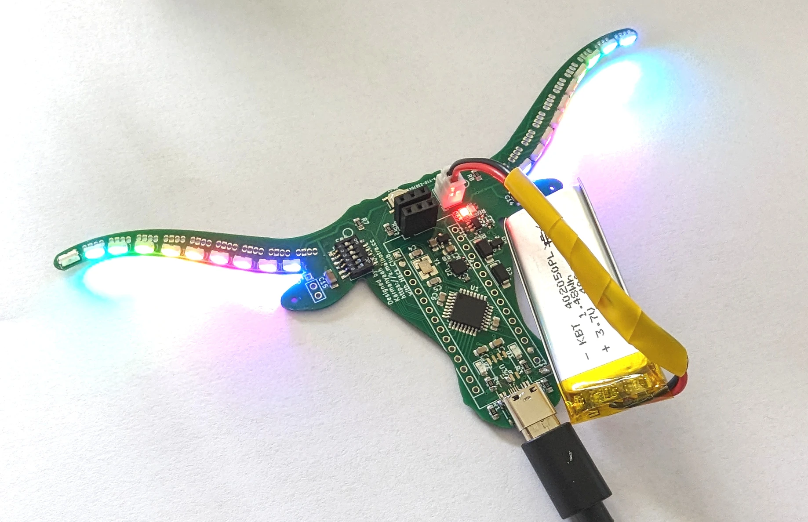

---  
tags:
  - hardware
  - arduino
  - pcb
category: projects  
date: 2023-09-15 00:25 -0500  
title: "Project SparkleTilt: My Longhorn LED Level PCB"  
commentslug: 2023-sparkletilt  
toc: false
mathjax: false
---

I made a Longhorn shaped level with Addressable RGB LEDs (Neopixels) and it's also an Arduino!!!!

This video demos all the features of this board:
<iframe width="560" height="315" src="https://www.youtube-nocookie.com/embed/px2V8bZMeLI" title="YouTube video player" frameborder="0" allow="accelerometer; autoplay; clipboard-write; encrypted-media; gyroscope; picture-in-picture; web-share" allowfullscreen></iframe>

A lot of my reasoning and instructions for making this board can be found on this (very very preproduction) workshop I'm writing on how to make this board: <https://workshops.hackclub.com/external-preview/karmanyaahm/onboard/pcb_level_4/>

TODO: add more info from video in text form, post schematics and source code on GitHub??

## Notes

None of this would've been possible without the following individuals and groups. Huge thanks to:
- TODO: Code on GitHub, link to libraries
- Hugo Hu for his Corgi Arduino design
- Hack Club for inspiring and funding this 
- Kognise for the cool header photo editing
